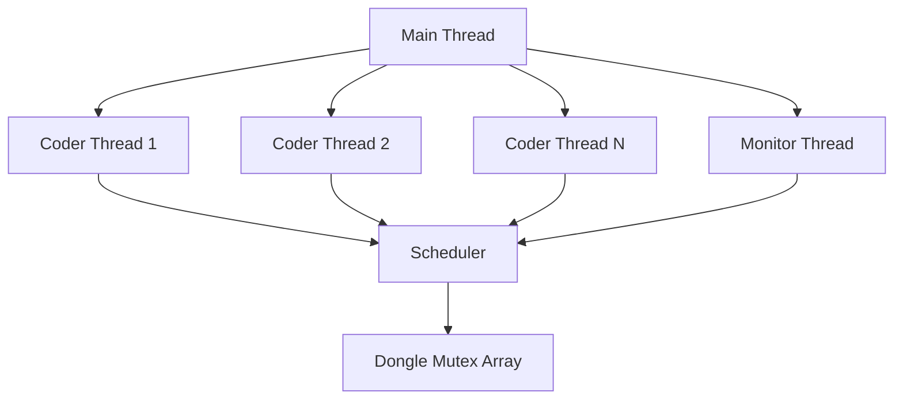
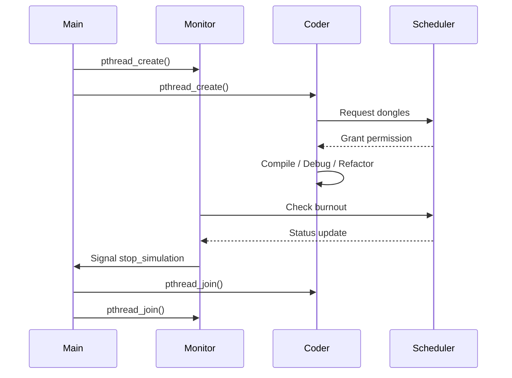
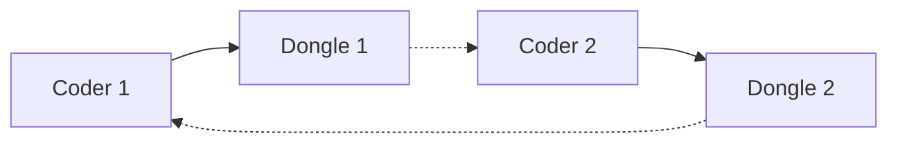
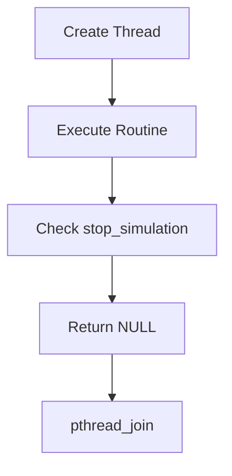

*This project has been created as part of the 42 curriculum by julcleme.*

# Codexion

[](https://github.com/canarddu38/codexion/actions/workflows/compilation.yml)
[](https://github.com/canarddu38/codexion/actions/workflows/norm.yml)

## Description

Codexion is a multithreaded concurrency simulation written in C using POSIX threads (`pthread`).  
It models a group of coders competing for shared resources called **dongles** in order to compile, debug, and refactor code.

The project explores:

- Thread creation and lifecycle management
- Mutex and condition variable synchronization
- Deadlock prevention strategies
- Starvation avoidance
- Cooldown handling
- Precise burnout detection
- Thread-safe log serialization

Each coder runs in its own thread and interacts with shared resources under strict synchronization constraints.
A dedicated **monitor thread** supervises the system to detect burnout and terminate the simulation safely.

The objective of the project is to design a robust concurrent system that:

- Avoids deadlocks
- Prevents starvation
- Ensures fairness
- Guarantees clean thread termination
- Maintains deterministic, serialized logs

---

# Architecture Overview

## Global System Structure



---

# Execution Flow



---

# Instructions

## Compilation

Using the provided Makefile:

```bash
make
```

Or manually:

```bash
gcc -Wall -Wextra -Werror -pthread *.c -o codexion
```

---

## Execution

```
./codexion \
<nb_coders> \
<time_to_burnout> \
<time_to_compile> \
<time_to_debug> \
<time_to_refactor> \
<nb_compiles_required> \
<dongle_cooldown> \
<scheduler_mode>
```

### Example

```bash
./codexion 5 800 200 200 200 3 100 edf
```

---

# Thread Synchronization Mechanisms

This project uses the following threading primitives:

- `pthread_mutex_t`
- `pthread_cond_t`
- Centralized scheduler coordination
- Serialized logging mechanism

---

## 1. Mutexes (`pthread_mutex_t`)

### Used for:

- Protecting dongles (shared resources)
- Protecting scheduler state
- Protecting burnout detection data
- Serializing log output

### Example: Dongle Protection

```c
pthread_mutex_lock(&dongles[i]);
/* critical section */
pthread_mutex_unlock(&dongles[i]);
```

This prevents two coders from using the same dongle simultaneously.

---

## 2. Condition Variables (`pthread_cond_t`)

Used to:

- Suspend coders while waiting for dongles
- Wake coders when resources become available
- Avoid busy waiting and CPU spinning

```c
pthread_cond_wait(&scheduler->cond, &scheduler->mutex);
pthread_cond_signal(&scheduler->cond);
```

This ensures:

- Efficient blocking
- Fair wake-up ordering
- Thread-safe communication between coders and scheduler

---

## 3. Scheduler Coordination

The scheduler:

- Tracks dongle availability
- Tracks cooldown timers
- Maintains fairness policy
- Serializes access decisions
- Controls simulation termination (`stop_simulation`)

All shared scheduler state is accessed under `scheduler->mutex`.

This guarantees:

- No race conditions
- Deterministic state transitions
- Safe thread communication

---

## 4. Race Condition Prevention

Race conditions are prevented by:

- Locking the scheduler mutex before modifying shared state
- Locking dongle mutex before usage
- Accessing `stop_simulation` under mutex
- Serializing logs

Example:

```c
pthread_mutex_lock(&scheduler->mutex);
scheduler->stop_simulation = 1;
pthread_mutex_unlock(&scheduler->mutex);
```

---

# Blocking Cases Handled

## 1. Deadlock Prevention

Deadlocks are avoided by addressing Coffman’s four conditions:

### Mutual Exclusion  
Dongles are protected by mutexes.

### Hold and Wait  
Coders do not hold partial resources indefinitely while waiting.

### No Preemption  
Resource allocation is controlled by the scheduler.

### Circular Wait  
Resource acquisition order and centralized arbitration prevent circular dependency.

### Deadlock Model



Circular waiting is prevented by scheduler control.

---

## 2. Starvation Prevention

Handled through:

- Scheduler queue management
- Fair wake-up strategy
- Controlled cooldown enforcement

Every coder eventually gains access to resources.

---

## 3. Cooldown Handling

After a dongle is released:

- A cooldown timer prevents immediate reuse.
- Scheduler tracks `dongle_release` timestamps.

This prevents resource monopolization.

---

## 4. Precise Burnout Detection

The monitor thread:

- Periodically checks each coder’s last successful compile timestamp.
- If `current_time - last_compile > time_to_burnout`
- The simulation stops immediately.

Burnout detection is mutex-protected to avoid race conditions.

---

## 5. Log Serialization

Logs are serialized to prevent:

- Interleaving messages
- Timestamp disorder
- Output corruption

Only one thread logs at a time.

---

# Thread Lifecycle Management



All threads:

- Check `stop_simulation`
- Exit cleanly
- Are joined by `main`
- Leave no zombie threads
- Release all mutexes before exiting

---

# Technical Choices

- Centralized scheduler instead of naive locking
- Condition variables instead of busy waiting
- Strict error checking for:
  - `pthread_create`
  - `pthread_join`
  - `pthread_mutex_init`
  - `pthread_cond_init`
- Structured cleanup system
- Deterministic logging architecture

---

# Resources

## Documentation

- POSIX Threads Programming Guide  
- `man pthread_create`
- `man pthread_mutex_lock`
- Linux manual pages  

---

## AI Usage

AI tools were used for:

- Concurrency theory clarification
- Deadlock condition review
- README structural drafting
- Mermaid diagram formatting
- Thread lifecycle validation checklist

All concurrency architecture decisions and code were implemented and validated manually.

---

# Conclusion

Codexion demonstrates advanced control over:

- Thread synchronization
- Shared resource arbitration
- Deadlock avoidance
- Starvation prevention
- Safe thread lifecycle management
- Deterministic concurrent logging


This project emphasizes correctness, robustness, and clean concurrent system architecture — essential skills in systems programming.
